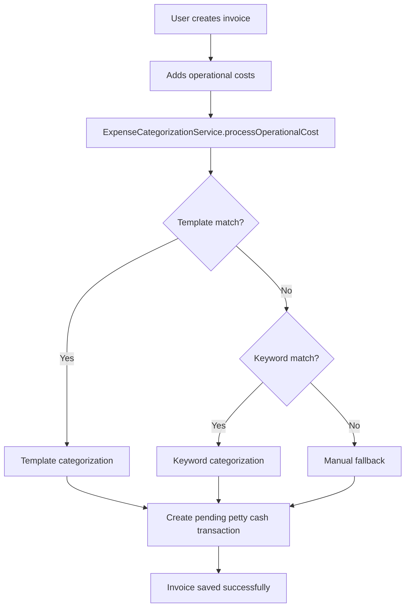
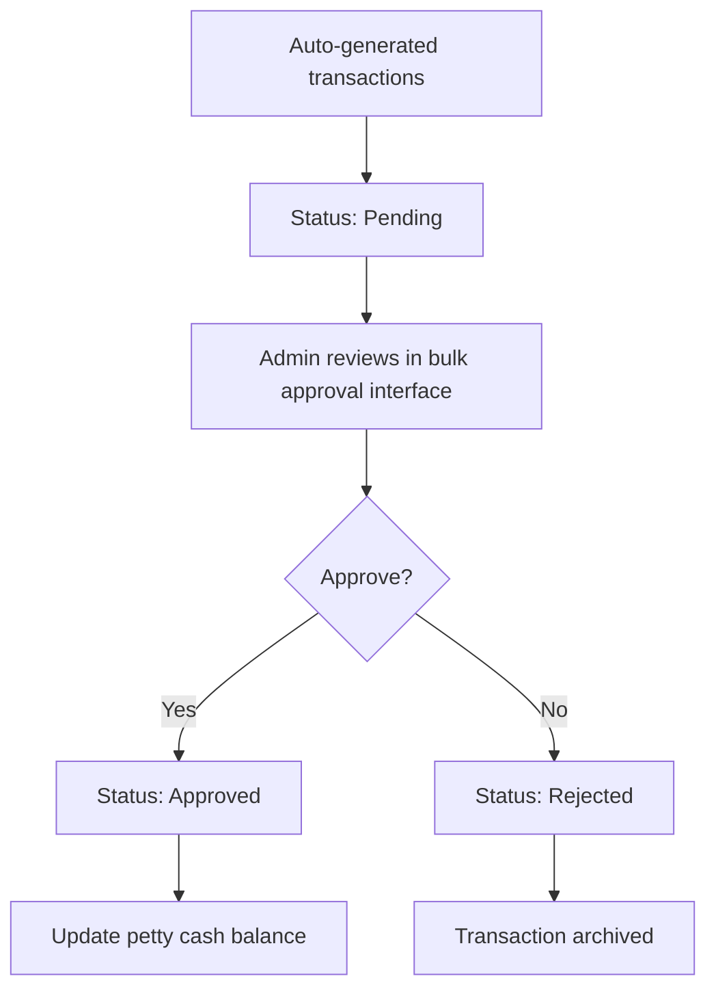

# 🔧 Technical Documentation - Expense Auto-Categorization System

## 📁 System Architecture

### Core Components

```
app/
├── Services/
│   └── ExpenseCategorizationService.php    # Main business logic
├── Models/
│   ├── ExpenseTemplate.php                 # Template model
│   ├── SimpleCategoryRule.php              # Keyword rules model
│   └── PettyCashTransaction.php            # Enhanced with template fields
├── Http/Controllers/
│   ├── Api/ExpenseTemplateController.php   # API endpoints
│   └── AdminKeuangan/PettyCashController.php  # Bulk approval interface
└── Http/Controllers/AdminKeuangan/
    └── InvoiceController.php               # Auto-generation trigger
```

### Database Schema

#### expense_templates
```sql
CREATE TABLE expense_templates (
    id BIGINT PRIMARY KEY,
    name VARCHAR(255) NOT NULL,
    category_id BIGINT NOT NULL,
    typical_amount_min DECIMAL(15,2),
    typical_amount_max DECIMAL(15,2),
    usage_count INT DEFAULT 0,
    is_active BOOLEAN DEFAULT TRUE,
    created_at TIMESTAMP,
    updated_at TIMESTAMP,
    FOREIGN KEY (category_id) REFERENCES petty_cash_categories(id)
);
```

#### simple_category_rules
```sql
CREATE TABLE simple_category_rules (
    id BIGINT PRIMARY KEY,
    keyword VARCHAR(100) NOT NULL,
    category_id BIGINT NOT NULL,
    weight INT DEFAULT 1,
    is_active BOOLEAN DEFAULT TRUE,
    created_at TIMESTAMP,
    updated_at TIMESTAMP,
    FOREIGN KEY (category_id) REFERENCES petty_cash_categories(id)
);
```

#### Enhanced petty_cash_transactions
```sql
ALTER TABLE petty_cash_transactions ADD COLUMN template_id BIGINT NULL;
ALTER TABLE petty_cash_transactions ADD COLUMN categorization_method ENUM('template','keyword','manual');
ALTER TABLE petty_cash_transactions ADD COLUMN auto_generated BOOLEAN DEFAULT FALSE;
ALTER TABLE petty_cash_transactions ADD COLUMN invoice_id BIGINT NULL;
ALTER TABLE petty_cash_transactions ADD COLUMN invoice_item_id BIGINT NULL;
```

## 🔄 Process Flow

### 1. Invoice Creation Flow


### 2. Categorization Logic
```php
// Priority 1: Template-based
if ($templateId) {
    return $this->processViaTemplate($templateId, $amount);
}

// Priority 2: Keyword-based
$keywordResult = $this->processViaKeywords($description);
if ($keywordResult) {
    return $keywordResult;
}

// Priority 3: Manual fallback
return $this->processViaManual($description);
```

### 3. Approval Workflow


## 🛠️ API Endpoints

### Expense Template API
```
GET    /admin-keuangan/api/expense-templates/by-category
POST   /admin-keuangan/api/expense-templates/check-keywords
GET    /admin-keuangan/api/expense-templates/popular
POST   /admin-keuangan/api/expense-templates/process-operational-cost
GET    /admin-keuangan/api/expense-templates/stats
```

### Petty Cash Bulk Approval
```
GET    /admin-keuangan/petty-cash/pending-approval
POST   /admin-keuangan/petty-cash/bulk-approve
POST   /admin-keuangan/petty-cash/bulk-reject
GET    /admin-keuangan/petty-cash/{id}/edit-pending
PUT    /admin-keuangan/petty-cash/{id}/update-pending
```

## 🔍 Key Classes & Methods

### ExpenseCategorizationService

#### processOperationalCost()
```php
public function processOperationalCost(array $data): array
{
    // Main entry point for categorization
    // Returns standardized result array
}
```

#### autoGeneratePettyCashFromInvoice()
```php
public function autoGeneratePettyCashFromInvoice($invoice): array
{
    // Bulk process all operational costs in an invoice
    // Creates pending petty cash transactions
}
```

### ExpenseTemplate Model

#### Key Methods
```php
public function getFormattedAmountRangeAttribute(): string
public function incrementUsage(): void
public function isInAmountRange(float $amount): bool
public static function findBestMatch(int $categoryId, float $amount): ?self
```

### SimpleCategoryRule Model

#### checkKeywords()
```php
public static function checkKeywords(string $description): ?array
{
    // Static method for keyword matching
    // Returns category info or null
}
```

## 🎛️ Configuration

### Environment Variables
```env
# No special config required, uses existing Laravel DB settings
DB_CONNECTION=mysql
DB_HOST=127.0.0.1
DB_PORT=3306
DB_DATABASE=office_management
```

### Seeder Configuration
```php
// Database seeding order:
1. PettyCashCategorySeeder     // Base categories
2. ExpenseTemplateSeeder       // 20 templates
3. SimpleCategoryRuleSeeder    // 63 keyword rules
```

## 📊 Performance Considerations

### Database Indexing
```sql
-- Recommended indexes
CREATE INDEX idx_petty_cash_auto_generated ON petty_cash_transactions(auto_generated, status);
CREATE INDEX idx_petty_cash_categorization ON petty_cash_transactions(categorization_method);
CREATE INDEX idx_expense_templates_category ON expense_templates(category_id, is_active);
CREATE INDEX idx_category_rules_active ON simple_category_rules(is_active);
```

### Caching Strategy
- Template data: Cache for 1 hour (rarely changes)
- Category rules: Cache for 30 minutes
- Category list: Cache for 24 hours

### Memory Usage
- Service instantiation: ~2MB
- Template processing: ~1MB per 100 items
- Keyword matching: ~0.5MB per 1000 rules

## 🔒 Security Considerations

### Input Validation
```php
// All inputs validated through Laravel Request validation
'description' => 'required|string|max:255',
'amount' => 'required|numeric|min:0.01',
'category_id' => 'exists:petty_cash_categories,id'
```

### Authorization
- Only `admin_keuangan` role can access bulk approval
- Auto-generation requires authenticated user
- Template selection restricted to active templates

### SQL Injection Prevention
- All database queries use Eloquent ORM
- Parameter binding for raw queries
- Input sanitization for keyword matching

## 🧪 Testing

### Unit Tests
```php
// Test categories
- ExpenseCategorizationServiceTest
- ExpenseTemplateTest
- SimpleCategoryRuleTest
```

### Integration Test
```bash
php test_expense_categorization.php
```

### Test Data
```php
// Minimum test data required:
- 7 PettyCash categories
- 20 Expense templates
- 63 Keyword rules
```

## 📈 Monitoring & Metrics

### Key Metrics
```php
// Track these metrics:
- Template usage count (ExpenseTemplate::usage_count)
- Categorization accuracy by method
- Auto-approval rate
- Processing time per invoice
```

### Logging
```php
// Key log points:
\Log::info('Auto-categorization completed', [
    'invoice_id' => $invoice->id,
    'transactions_created' => count($transactions),
    'categorization_methods' => $methods
]);
```

### Error Tracking
```php
// Common error scenarios:
- Template not found (Cat001)
- Keyword matching failure (Cat002)
- Database connection issues (Cat003)
- Service initialization errors (Cat004)
```

## 🚀 Deployment Checklist

### Pre-deployment
- [ ] Run migrations: `php artisan migrate`
- [ ] Seed data: `php artisan db:seed`
- [ ] Clear caches: `php artisan cache:clear`
- [ ] Test API endpoints
- [ ] Verify permissions

### Post-deployment
- [ ] Monitor error logs
- [ ] Check auto-generation functionality
- [ ] Verify bulk approval interface
- [ ] Test template selection
- [ ] Monitor performance metrics

### Rollback Plan
```bash
# Emergency rollback
php artisan migrate:rollback --step=3
# Remove auto-generation from InvoiceController
# Disable bulk approval routes
```

## 📝 Maintenance

### Regular Tasks
- Monthly: Review template usage, add new templates
- Weekly: Check keyword rule effectiveness
- Daily: Monitor error logs and performance

### Performance Optimization
```php
// Optimize heavy queries
$templates = ExpenseTemplate::with('category')
    ->where('is_active', true)
    ->orderBy('usage_count', 'desc')
    ->limit(10)
    ->get();
```

### Data Cleanup
```sql
-- Archive old rejected transactions (monthly)
DELETE FROM petty_cash_transactions
WHERE status = 'rejected'
AND auto_generated = true
AND created_at < DATE_SUB(NOW(), INTERVAL 3 MONTH);
```

---

**Version**: 1.0
**Last Updated**: 7 Oktober 2025
**Maintainer**: Development Team